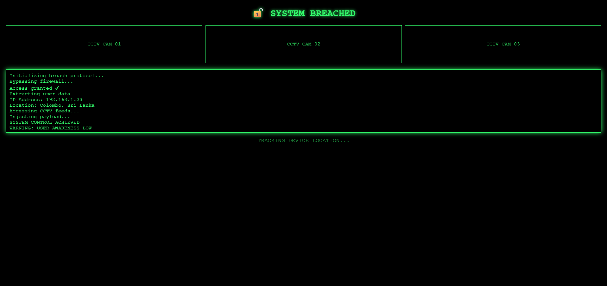

# 🟢 Cyber Prank 🟢

Cyber Prank is a cinematic, hacker-style prank web experience built just for fun😈 When someone opens this project, it
simulates a fake hacking scene with green-themed visuals, CCTV-style panels, and auto-typing terminal code — making it
look like their system is being accessed. It is a 100% visual prank, safe, harmless, and created only for entertainment
purposes.

## 🛠️ Technologies

✅ HTML 
✅ CSS 
✅ JavaScript 
✅ jQuery 

## 🚀 Features

✅ Green hacker-themed UI inspired by cyber/terminal aesthetics. 
✅ Fake system access & “system breached” loading screen. 
✅ Auto-typing terminal code animation (hacker simulation). 
✅ CCTV-style camera panels for dramatic effect. 
✅ Blinking warnings and system messages. 
✅ Final reveal message indicating it’s just a prank 😎. 
✅ Fully responsive (works on mobile and desktop). 

## 📸 Screenshots

### Loading / Access Screen

### Hacker Simulation Screen

### Prank Reveal Screen

## 📝 Version

**1.0.0**

## 📬 Get in Touch

Have ideas to improve this prank or want to add more cyber effects?  
Feel free to reach out:

📧 [kavithmathushal9007@gmail.com](mailto:kavithmathushal9007@gmail.com)

#### This project is licensed under the [GNU License](LICENSE)

#### © 2026 All Rights Reserved | Designed by [Kavithma Thushal](https://github.com/Kavithma-Thushal)

#### 🟢 Built for fun, creativity, and harmless pranks 🟢

